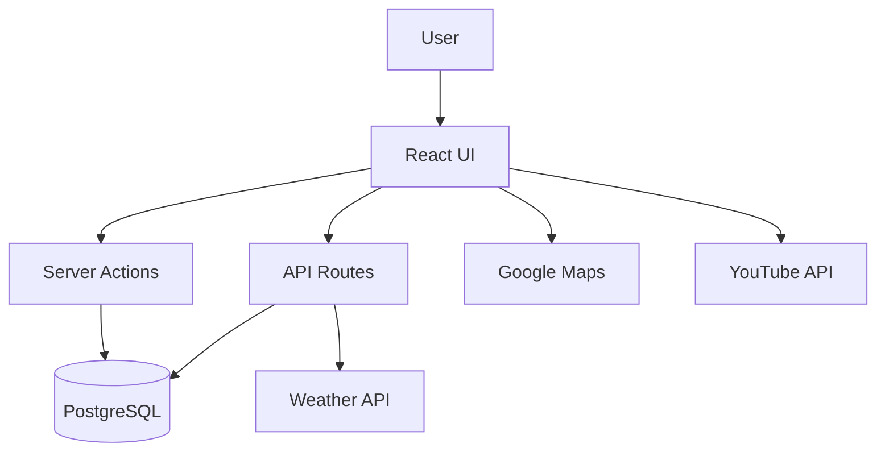

# 🌦️ Weather Dashboard

A full-stack weather application built with **Next.js**, **TypeScript**, **PostgreSQL**, and external weather APIs.

The application allows users to search historical weather information for any location and date range, stores the retrieved data in a PostgreSQL database, and provides complete CRUD functionality together with data export capabilities.

> **PM Accelerator Technical Assessment**
>
> ✅ Frontend Assessment #1  
> ✅ Backend Assessment #2

## Features

### Weather Search
- Search weather history by location and date range.
- Automatic location validation.
- Automatic date validation.
- Missing weather records are retrieved from an external weather API.

### Database Integration
- PostgreSQL database.
- Automatic caching of weather records.
- Prevents duplicate records using unique constraints.

### CRUD Operations

- ✅ Create
- ✅ Read
- ✅ Update selected weather information
- ✅ Delete records

### Data Export

Export search results as:

- CSV
- JSON
- XML
- Markdown
- PDF

### Additional API Integrations

- Google Maps
- YouTube videos related to the selected location

### User Experience

- Responsive design
- Confirmation dialogs
- Loading states
- Error handling
- Interactive weather cards

## Tech Stack

### Frontend

- Next.js 15
- React
- TypeScript
- TailwindCSS
- Heroicons

### Backend

- Next.js Route Handlers
- Server Actions

### Database

- PostgreSQL
- postgres.js

### Validation

- Zod

### External APIs

- Meteosource API
- Google Maps API
- YouTube Data API

### PDF generation

- jsPDF
- AutoTable



app/

├── home/

├── api/

├── lib/

│ ├── actions.ts

│ ├── data.ts

│ ├── exports.ts

│ ├── definitions.ts

│ └── validation.ts

├── ui/

└── public/

## Installation

```bash
git clone ...

npm install
```

Create a `.env.local`

```env
POSTGRES_URL=

METEOSOURCE_API_KEY=

GOOGLE_MAPS_API_KEY=

YOUTUBE_API_KEY=
```

Run

```bash
npm run dev
```

## PM Accelerator Assessment

### Frontend

- Responsive interface
- Input validation
- API integration
- Modern UI
- Google Maps integration
- YouTube integration

### Backend

- REST API endpoints
- PostgreSQL database
- CRUD operations
- Server Actions
- Zod validation

Completed:
- ✅ Tech Assessment #1
- ✅ Tech Assessment #2

## Future Improvements

- User authentication
- Favorites
- Dark mode
- Weather charts
- Forecast comparison
- Internationalization

## Author

Mauricio Casarotto

Developed as part of the PM Accelerator Technical Assessment.